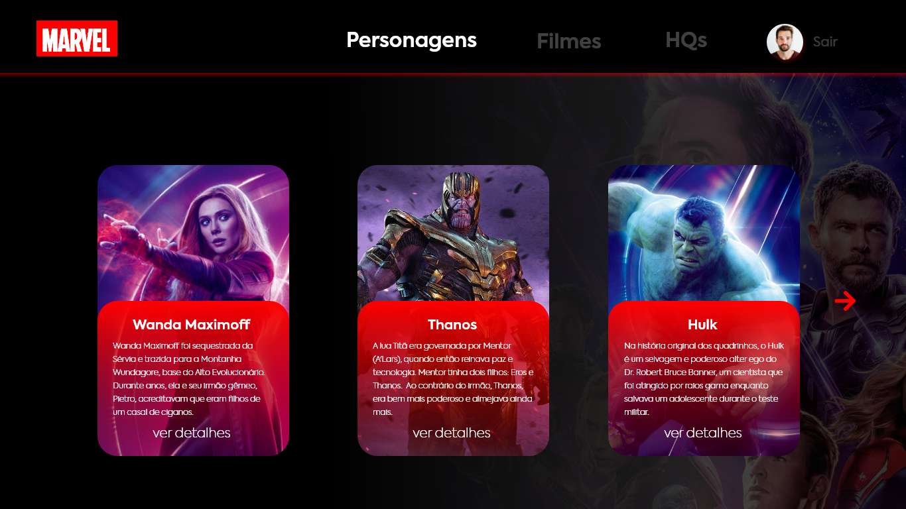

## MARVEL-MCU



## Tecnologies

This project was developed using cutting edge front-end technologies.

- [ReactJS](https://reactjs.org/)
- [Typescript](https://www.typescriptlang.org/)

## 💻 Getting started

### Requirements

- You need to install both [Node.js](https://nodejs.org/en/download/) and [Yarn](https://yarnpkg.com/) to run this project.

**Clone the project and access the folder**

```bash
$ git clone https://github.com/Thalesousa/marvel-mcu.git && cd marvel-mcu
```

**Follow the steps below**

```bash
# Install the dependencies
$ yarn

# Run the backend fake server
$ yarn server

# Run the web 
$ yarn start
```

The app will be available for access on your browser at `http://localhost:3000`

## 📝 License

This project is licensed under the MIT License - see the [LICENSE](LICENSE) file for details.

---

Made with 💜 by Thales Sousa 👋 [Check out my LinkedIn](https://www.linkedin.com/in/thalesousa)
  '